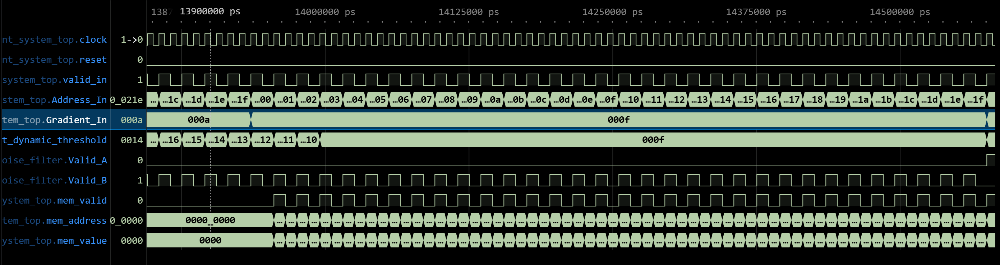
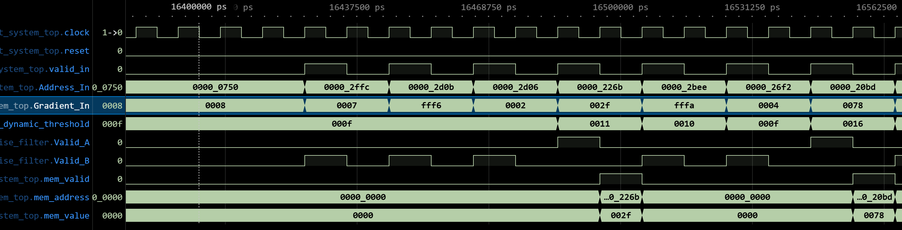
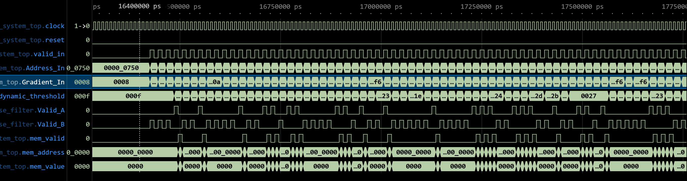

### [逻辑推演 (CoT) 与架构评估]

基于系统级的硬件设计视角，我对该代码的逻辑推演如下：

1. **数据路径与算法级优化 (PPA 视角)：**
* 算法定义为  。该设计极其明智地使用了右移操作 (`>>`) 代替乘法器来实现 EMA 权重 () 。这在芯片设计中显著降低了面积 (Area) 和功耗 (Power)，且完全没有牺牲吞吐率。

2. **绝对值处理：**
* 代码正确处理了有符号输入 `Gradient_In`：若最高位（符号位）为 `1`，则执行补码取反加一操作 (`~Gradient_In + 1'b1`) ；否则直接保留原值 。

3. **算术精度与防溢出设计 (Saturation Logic)：**
* 运算路径中扩展了1位位宽 (`[GRAD_WIDTH:0]`) 用于捕获加法和减法过程中的进位/借位 。

* 饱和逻辑监控加法结果的最高位 (`addition_result[GRAD_WIDTH]`)。一旦检测到溢出，立即将阈值钳位至最大值 (`{GRAD_WIDTH{1'b1}}`) 。这是一个标准的工业级安全设计。

4. **时序与控制逻辑：**
* 纯组合逻辑计算和时序状态更新被干净地分离。阈值更新受到 `valid_in` 信号的严格门控 。若 `valid_in` 无效，新阈值保持不变 ；有效则在时钟上升沿更新 ，复位时恢复为 `INIT_THRESHOLD` 。无明显时序违例风险（组合逻辑级数较浅：绝对值 -> 移位 -> 减法 -> 加法 -> 多路选择器）。

### 中英文逻辑分析报告 (双语报告供复制)

#### 🇨🇳 中文分析 (Chinese Analysis)

**模块名称：** `dynamic_threshold_controller`

**功能描述：** 该模块旨在基于输入梯度的绝对值计算动态阈值，采用硬件友好的指数移动平均 (EMA) 算法 。

**架构与逻辑亮点：**

* **无乘法器架构 (Multiplier-less Architecture)：** 通过位移操作实现了 EMA 权重参数 () 。相比于传统的浮点或定点乘法器，该方案极大地优化了 PPA (性能、功耗、面积)。

* **高鲁棒性数据路径 (Robust Datapath)：** 模块内部计算绝对值时严格遵循了二进制补码逻辑 。在核心加减法运算阶段，额外分配了1位冗余位以监控进位与借位情况 。

* **安全钳位机制 (Saturation Mechanism)：** 为防止阈值寄存器发生破坏性的翻转溢出，组合逻辑中嵌入了饱和截断机制 。当运算结果超出限定位宽时，输出会被强制钳位至全 `1` 的最大物理值 。

* **严格的时序分离与握手门控 (Timing & Gating)：** 组合计算与时序更新逻辑严格解耦，且内部状态机更新完全受 `valid_in` 握手信号把控 。

#### 🇺🇸 英文分析 (English Analysis)

**Module:** `dynamic_threshold_controller`

**Description:** This module dynamically calculates an adaptive threshold based on the magnitude of incoming gradients using a hardware-efficient Exponential Moving Average (EMA) algorithm.

**Architecture & Logic Highlights:**

* **Multiplier-less Architecture:** The design cleverly implements the EMA weight parameter () strictly through arithmetic right shifts. Compared to traditional multipliers, this approach drastically optimizes PPA (Performance, Power, and Area).

* **Robust Datapath:** The absolute value extraction correctly processes two's complement signed inputs. During the core addition and subtraction phases, an extra precision bit is allocated to monitor carries and borrows.

* **Saturation Mechanism:** To prevent catastrophic wrap-around overflow in the threshold register, saturation arithmetic is embedded in the combinational datapath. If an overflow occurs, the output is forcefully clamped to the maximum representable value (all `1`s).

* **Strict Timing & Gating:** Combinational computation paths and sequential register updates are cleanly decoupled. State transitions are strictly gated by the `valid_in` control signal.

以下是针对您的梯度系统（Gradient System）测试平台推荐的波形截取信号及时间段分析。

### 1. 推荐截取的波形信号 (Recommended Signals to Extract)

为了完整展示系统的数据流向和动态阈值机制，建议在波形查看器（如 GTKWave）中将信号按以下逻辑分组：

* **系统控制 (System Control)**
* `clock` / `reset`: 基础时钟和复位信号。(Basic clock and reset signals.)

* **输入接口 (Input Interface)**
* `valid_in`: 输入有效标志。(Input valid flag.)
* `Address_In`: 输入梯度地址。(Input gradient address.)
* `Gradient_In`: 输入梯度值。(Input gradient value.)

* **核心内部信号 (Core Internal Signals - 体现动态阈值)**
* `dut.current_dynamic_threshold`: **必须截取**。这是由 EMA 计算出的实时动态阈值。( **Crucial**. The real-time dynamic threshold calculated via EMA.)
* `dut.u_noise_filter.path_a_valid`: 高幅度直通路径有效标志。(High-magnitude bypass path valid flag.)
* `dut.u_noise_filter.path_b_valid`: 低幅度缓存路径有效标志。(Low-magnitude cache path valid flag.)

* **输出接口 (Output Interface)**
* `mem_valid`: 内存写入有效标志。(Memory write valid flag.)
* `mem_address` / `mem_value`: 输出到内存的地址和数据。(Address and data output to memory.)

### 2. 推荐截取的时间段及波形分析 (Recommended Time Windows & Analysis)

建议在报告中放入以下两个关键阶段的波形图，它们最能体现系统的核心设计意图。

#### 时间段 1：混合累加与阈值交叉阶段 (Phase 3: Mixed Accumulation & Threshold Crossing)

* **推荐截取时间 (Recommended Time):** `13,900,000 ns` 至 `14,600,000 ns`  

* **中文分析解释:**
在这个阶段，输入梯度 `Gradient_In` 的幅度从 10 跃升到 15，随后又增加到 40。可以通过观察波形发现，当输入较小时，数据被路由到缓存（`path_b_valid` 拉高），输出端 `mem_valid` 保持静默。随着梯度幅度增大并越过当前的动态阈值，数据开始从缓存中被触发逐出，或者直接通过高幅度路径（`path_a_valid` 拉高）输出，导致 `mem_valid` 产生密集的写操作。
* **English Analysis:**
During this phase, the input magnitude (`Gradient_In`) jumps from 10 to 15, and then to 40. The waveform will show that for smaller inputs, data is routed to the cache (`path_b_valid` goes high), while the output `mem_valid` remains silent. As the gradient magnitude increases and crosses the current dynamic threshold, data is either evicted from the cache or routed directly through the high-magnitude path (`path_a_valid` goes high), resulting in dense write operations on `mem_valid`.

#### 时间段 2：EMA 动态阈值收敛阶段 (Phase 5: EMA Dynamic Threshold Convergence)

* **推荐截取时间 (Recommended Time):** `16,400,000 ns` 至 `17,500,000 ns`  
  

* **中文分析解释:**
这是体现动态阈值（Dynamic Threshold）最核心的波形。在此期间，测试平台注入了大量随机大小（小、中、大）的梯度值。重点观察 `dut.current_dynamic_threshold` 信号。您会看到该阈值并没有随着输入数据的剧烈跳变而产生尖峰突变，而是表现出平滑的收敛特性。当出现连续的高幅度梯度（如 120, 149）时，阈值会呈指数级平滑上升；当输入恢复到低幅度时，阈值又会平缓下降。这直接证明了固定位移（Shift-based）EMA 算法在防止溢出的同时，成功实现了自适应的平滑调节。
* **English Analysis:**
This is the most critical waveform to demonstrate the Dynamic Threshold. During this period, the testbench injects a large number of random gradient values (small, medium, large). Focus closely on the `dut.current_dynamic_threshold` signal. You will observe that the threshold does not spike abruptly with sharp changes in input data; instead, it exhibits smooth convergence. When sustained high-magnitude gradients (e.g., 120, 149) appear, the threshold smoothly ramps up. When the input returns to low magnitudes, the threshold gently decreases. This directly proves that the shift-based EMA algorithm successfully achieves adaptive, smooth regulation while preventing overflow.
